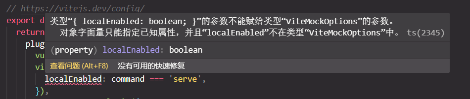
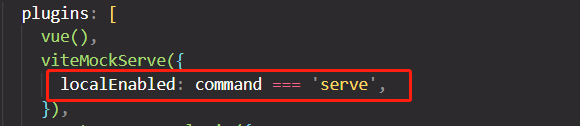

# mock接口踩坑指南


### 报错信息

`vite.config.ts ` 报错信息




`package.json`  再看看安装版本


### 解决方案

1. 将`vite.config.ts ` 中的 `vite-plugin-mock` 和 `mockjs` 删除重装
   ```
   pnpm uninstall xxxx
   ```

   

2. 将`vite-plugin-mock`  降低版本至`2.9.6`
   ```
    pnpm install -D vite-plugin-mock@2.9.6
   ```


完美解决

