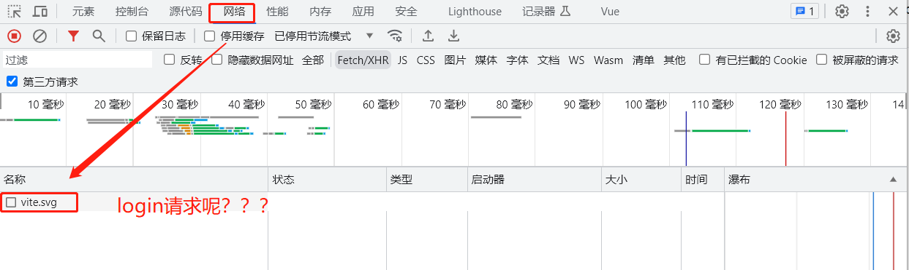
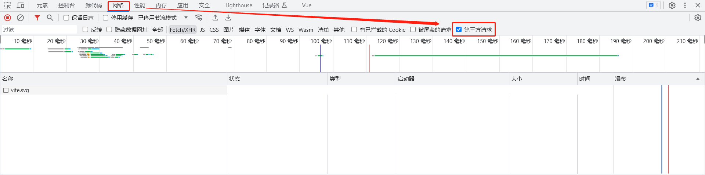
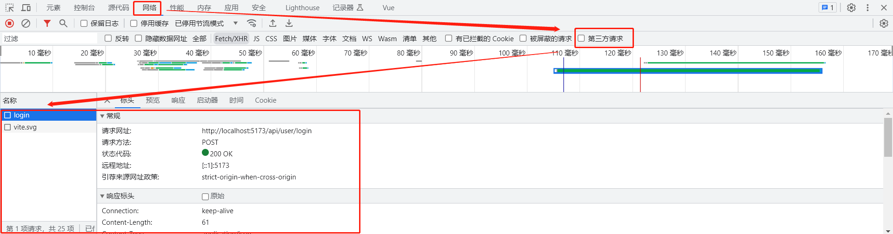

# axios踩坑指南


### 问题记录

在`onMounted`执行`reqLogin`请求，却在浏览器找不到这个请求。




`判断`：我很纳闷，猜想如下几点出问题。

1. `onMounted`没有进去，函数没有执行。
2. 获取配置的环境变量不是`/api`。

```vue
onMounted(() => {
  console.log(import.meta.env.VITE_APP_BASE_API)
  reqLogin({ username: 'admin', password: '111111' })
})
```

`结果`：执行后数据都能打印出来，说明方法正确。


### 解决方案

后来经过长时间折腾，发现原来是这个问题。

当勾选第三方请求时，不会显示。



当取消勾选第三方请求时，会显示。

