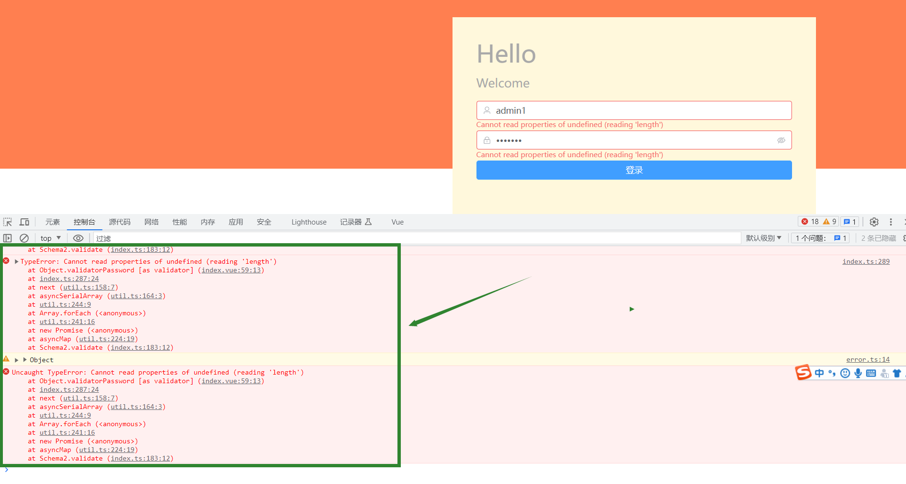

# 自定义校验表单踩坑指南


### 报错内容：

```
Uncaught TypeError: Cannot read properties of undefined (reading 'length')
    at Object.validatorPassword [as validator]
```

```
Uncaught TypeError: Cannot read properties of undefined (reading 'length')
    at Object.validatorPassword [as validator]
```


今天踩了个巨坑，折腾了几个钟没解决。

在写表单验证时，一直报上面的错误，但是能正常执行按钮的逻辑，人都被整麻了。





### 真相只有一个

在化身为福尔摩斯，经过缜密的思考，终于找出了元凶。

```vue
<el-form class="login_form" v-model="loginForm" :rules="rules" ref="validateForm">
	//中间省略  
</el-form-item>
```


**真相：使用`v-model`会报以上的错误，使用`:model`时正常。**


**原因：**

```
v-model是vue.js中内置的双向数据绑定指令，用于表单控件以外的标签是不起作用的(即只对表单控件标签的数据双向绑定有效)。
```

```
:model相当于v-bind:model的缩写，v-bind动态绑定指令，默认情况下标签自带属性的值是固定的。
这种只是将父组件的数据传递到了子组件，并没有实现子组件和父组件数据的双向绑定。
当然引用类型除外，子组件改变引用类型的数据的话，父组件也会改变的。
```


