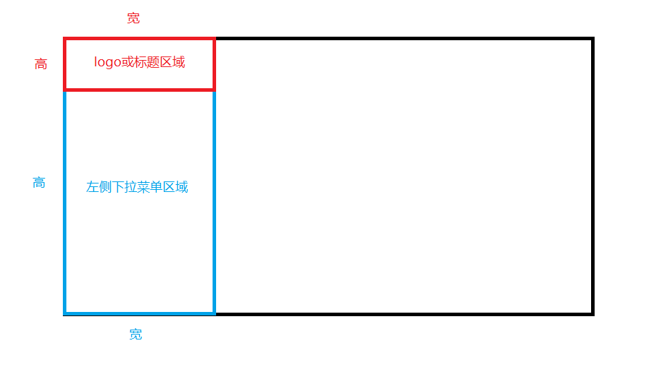
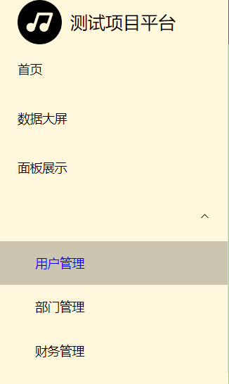
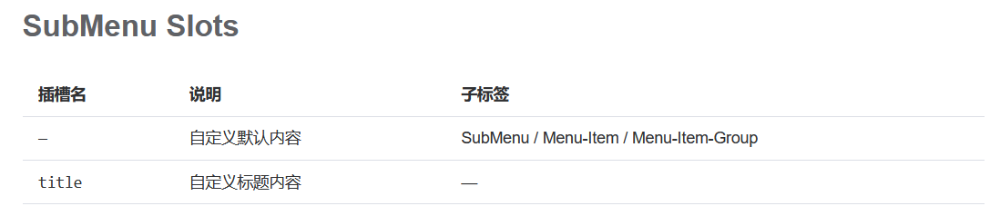

# 左侧菜单搭建


### 明确左侧结构

首先要明确左侧的结构，将宽高计算好，可用background-color区分，如下图所示：




### 使用menu组件

用组件展示菜单效果：

```vue
<el-menu background-color="cornsilk" text-color="blank" active-text-color="blue">
    <el-menu-item index="1-1-1">首页</el-menu-item>
    <el-menu-item index="1-1-2">数据大屏</el-menu-item>
    <el-menu-item index="1-1-3">面板展示</el-menu-item>
    <el-sub-menu index="1-2">
        <el-menu-item index="1-2-1">用户管理</el-menu-item>
        <el-menu-item index="1-2-2">部门管理</el-menu-item>
        <el-menu-item index="1-2-3">财务管理</el-menu-item>
    </el-sub-menu>
</el-menu>
```


### 坑：下拉菜单未展示标题

如下图所示：




官方文档说明，这种情况需要用插槽来定义标题内容。



加上如下内容即可：

```vue
<template #title>标题内容</template>
```


### 坑：菜单内容过多导致页面底部产生空白区域

这种情况，需要给菜单外面包裹一层滚动条，代码如下：

```vue
<el-scrollbar>
    <el-menu>
		菜单内容省略
    </el-menu>
</el-scrollbar>
```

