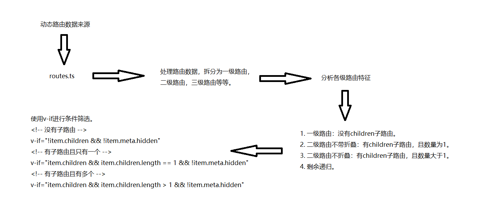

# 递归组件生成动态菜单

### 本质

想要弄清楚怎么生成动态菜单，须了解本质，也无非两点：

1. 数据源哪里来？
2. 得到数据源后，怎么处理？

### 数据源哪里来？

想想，你写完一个页面，想展示出来，是不是要配置路由。

知道了在路由配置，其实已经完成了99%，剩下无非是怎么处理成一级、二级、三级...路由。

### 得到数据源后，怎么处理？

区分各级路由的特征：

1. 一级路由：没有children子路由。
2. 二级路由不带折叠：有children子路由，且数量为1。
3. 二级路由不折叠：有children子路由，且数量大于1。
4. 三级路由：递归实现。

### 手把手带你画图了解

