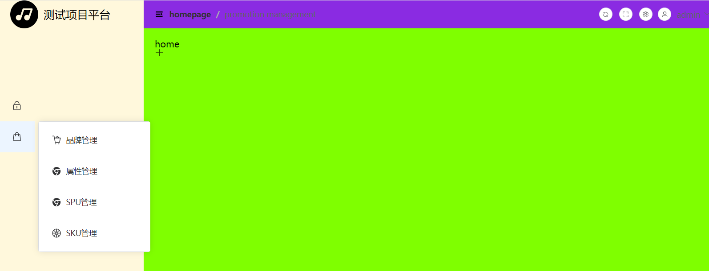
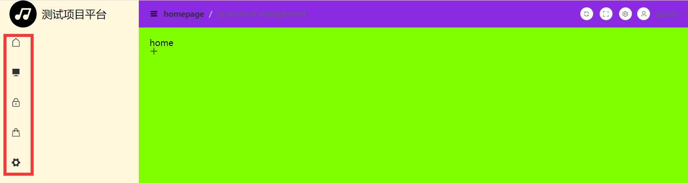

### 折叠菜单




折叠菜单出现这种情况，在图标前几行有空白区域。

是因为图标放在插槽内部了，如下代码所示：

```vue
<template v-if="!item.children && !item.meta.hidden">
  <el-menu-item :index="item.path" @click="goRoute">
    <template #title>
      <el-icon>
        <component :is="item.meta.icon"></component>
      </el-icon>
      <!-- <span>图标 &nbsp;</span> -->
      <span>{{ item.meta.title }}</span>
    </template>
  </el-menu-item>
</template>
```


需要把图标放入外部即可，如下代码所示：

```vue
<template v-if="!item.children && !item.meta.hidden">
  <el-menu-item :index="item.path" @click="goRoute">
    <el-icon>
      <component :is="item.meta.icon"></component>
    </el-icon>
    <template #title>
      <!-- <span>图标 &nbsp;</span> -->
      <span>{{ item.meta.title }}</span>
    </template>
  </el-menu-item>
</template>
```





### 页面加载时默认激活菜单

default-active ，页面加载时默认激活菜单的 index。