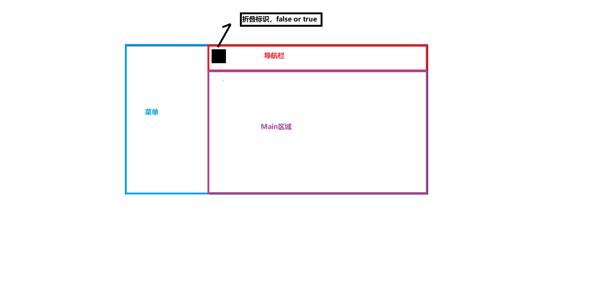
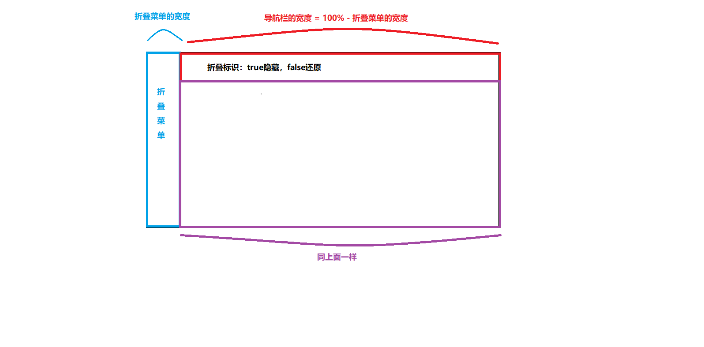

# 菜单折叠

### 原理：

1. 点击折叠图标
   1. 声明一个点击标识，true/false
   2. 该标识控制菜单折叠信号
2. 菜单收缩
   1. 菜单区域长度 = 折叠宽度
   2. collapse属性，使菜单水平折叠
3. 顶部导航栏长度变化
   1. 顶部导航栏长度 = 100% - 菜单折叠的宽度
4. Main区域长度变化
   1. Main区域长度 = 100% - 菜单折叠的宽度

### 手把手画图

折叠前：

折叠后：

