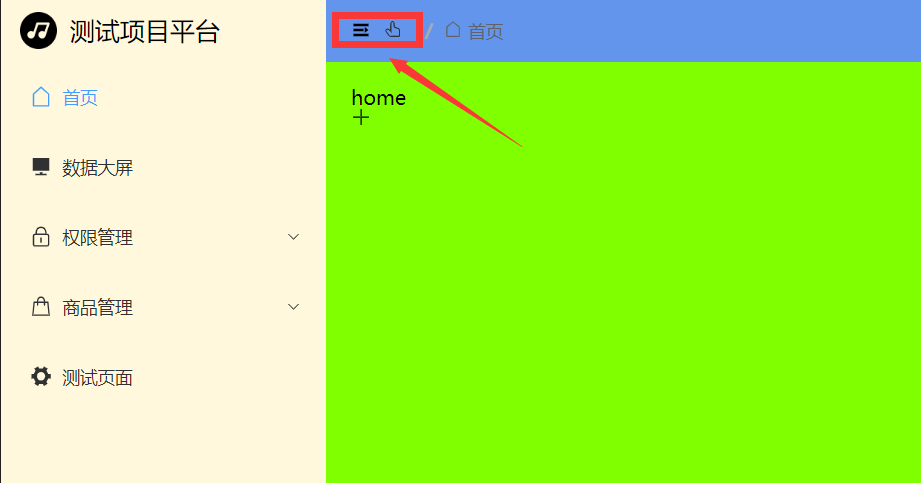
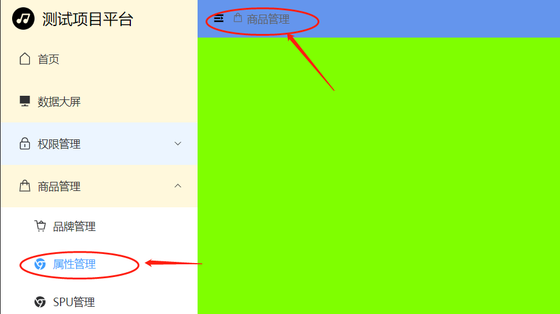

# 面包屑动态展示


### $route.matched

类型:Array，包含当前路由的所有嵌套路径片段的路由记录 。


### 遍历路由

面包屑可以通过遍历当前的`$route.matched`,得到配置的路由名称及图表。

```vue
<el-breadcrumb-item v-for="(item, index) in $route.matched" key="index">
  <el-icon>
    <component :is="item.meta.icon"></component>
  </el-icon>
  <span style="margin: 0px 5px">{{ item.meta.title }}</span>
</el-breadcrumb-item>
```


### 一级路由遇到的问题

​	一级路由前还有图表显示，明显是不合理的。




通过`v-show`过滤title为空的条件，示例如下：

```vue
<el-breadcrumb-item v-for="(item, index) in $route.matched" key="index" v-show="item.meta.title">
 	// ...省略
</el-breadcrumb-item>
```


### 点击面包屑一级目录跳转

​	点击一级路由跳转到Layout空白区域，情况如下：




需要在一级路由直接重定向到子路由的第一个，` redirect: '/父/子'`

```ts
  {
    path: '/product',
    component: () => import('@/layout/index.vue'),
    name: 'Product',
    redirect: '/product/trademark',
    meta: {
      title: '商品管理',
      hidden: false,
      icon: 'Goods',
    },
    children: [
      {
        path: '/product/trademark',
        component: () => import('@/views/product/trademark/index.vue'),
        name: 'Trademark',
        meta: {
          title: '品牌管理',
          hidden: false,
          icon: 'ShoppingCartFull',
        },
      }, 
    ],
  },
```

