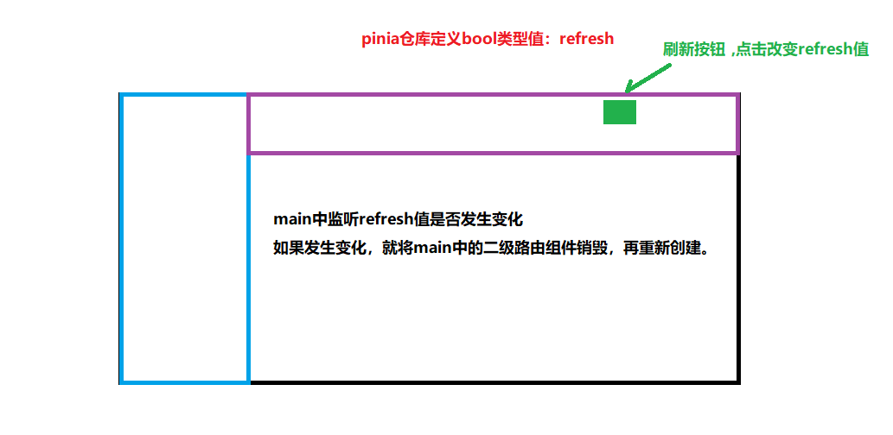

# 刷新业务的实现

### 仓库

​	定义一个bool值`refresh`

### tabbar

​	每次点击刷新图标，改变仓库的`refresh`值

### main

​	监听仓库的`refresh`值，使用`v-if` `nextTick`销毁路由组件再重新创建

​	原理：nextTick监听响应式数据发生变化，可以获取到更新后的DOM,更新后的DOM没有路由组件了，再创建新的组件

### 手把手画图

