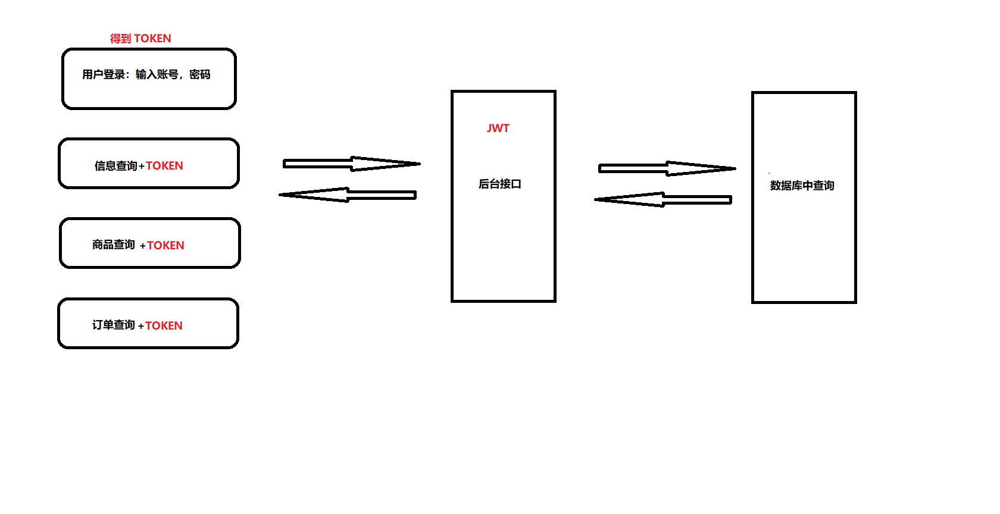

# token的理解


### 什么是token

token：每个用户的唯一标识。在有限的时间内，携带token向服务端接口发送请求。


### 流程

1. 首先在登录的时候输入账号和密码，调用接口和后台数据比对，
   如果比对成功，则把`token`,`用户名`,`头像`存入store小仓库里。

   ```ts
   //store 
   
   //创建用户小仓库
   let useUserStore = defineStore('User', {
     //小仓库存储数据的地方
     state: (): UserState => {
       return {
         token: GET_TOKEN(),
         username: '',
         avatar: ''
       }
     },
       actions: {
       async userLogin(data: loginForm) {
         //调用后台接口
         let result: loginResponseData = await reqLogin(data)
         if (result.code == 200) {
           //存储token
           this.token = result.data.token as string
           SET_TOKEN(result.data.token as string)
           return 'ok'
         } else {
           return Promise.reject(new Error(result.data.message))
         }
       },
      }
   
   ```

   

2. 登录成功后，会跳转首页，首页展示数据必须要请求接口才能拿到数据，所以在请求接口的时候，需要在请求头中携带`token`.

   

3. 所以需要在请求拦截器中，把仓库中的token值添加到请求头中。
   ```ts
   //request.ts
   
   import useUserStore from '@/store/modules/user'
   
   request.interceptors.request.use((config) => {
     //获取仓库内部的token，登录成功在携带给服务器
     const userStore = useUserStore();
     if (userStore.token) {
       config.headers.token = userStore.token
     }
   
     return config
   })
   ```


### 手把手画图


